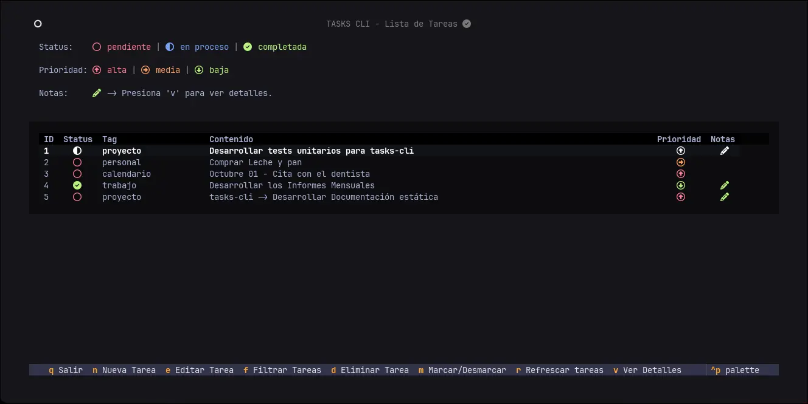

# Tasks-cli 


**Tasks-cli** es una aplicación de lista de tareas moderna y eficiente que se ejecuta completamente en tu terminal. Construida con [Textual](https://textual.textualize.io/), ofrece una interfaz de usuario rica e interactiva sin sacrificar la velocidad y simplicidad de la línea de comandos.

Este proyecto es un escaparate de buenas prácticas de desarrollo en Python, incluyendo una arquitectura limpia, tipado estático, pruebas automatizadas y una configuración de proyecto profesional.

---

## ✨ Características

-   **Interfaz Interactiva:** Navega, crea y edita tareas con atajos de teclado intuitivos.
-   **Organización Clara:** Asigna `status`, `tags` y `prioridad` a cada tarea.
-   **Filtrado Dinámico:** Encuentra rápidamente lo que necesitas filtrando por cualquiera de sus propiedades.
-   **Notas Detalladas:** Añade descripciones extensas y notas en formato Markdown a tus tareas.
-   **Persistencia:** Todas tus tareas se guardan en una base de datos SQLite local.
-   **Empaquetado Profesional:** Configurado con `pyproject.toml` y distribuido como un ejecutable único para Linux.

## 📸 Capturas de Pantalla


<p align="center">
  
</p>

## 🚀 Instalación y Uso

### Requisitos

-   Linux (el ejecutable está construido para este sistema).

### Opción 1: Usar el Ejecutable (Recomendado)

1.  Ve a la sección de [**Releases**](https://github.com/tu-usuario/tasks-cli/releases) de este repositorio.
2.  Descarga el archivo ejecutable `tasks-cli` de la última versión.
3.  Dale permisos de ejecución:
    ```bash
    chmod +x tasks-cli
    ```
4.  Ejecuta la aplicación:
    ```bash
    ./tasks-cli
    ```
    *(Opcional: Mueve el archivo a una carpeta en tu `PATH`, como `/usr/local/bin`, para poder ejecutarlo desde cualquier lugar simplemente escribiendo `tasks-cli`)*.

### Opción 2: Ejecutar desde el Código Fuente

Si prefieres ejecutarlo desde el código fuente, necesitarás Python 3.11+ y `uv`.

1.  Clona el repositorio:
    ```bash
    git clone https://github.com/tu-usuario/tasks-cli.git
    cd tasks-cli
    ```
2.  Crea el entorno virtual e instala las dependencias:
    ```bash
    uv venv
    uv pip install .
    ```
3.  Ejecuta la aplicación:
    ```bash
    tasks-cli
    ```

## 📚 Documentación

Para una guía de desarrollo detallada, una referencia completa de la API y una explicación de la arquitectura del proyecto, visita el **[sitio de documentación completo](https://Gustavo9481.github.io/tasks-cli/)**.

## ⚖️ Licencia

Este proyecto está bajo la Licencia MIT. Consulta el archivo [LICENSE](LICENSE) para más detalles.
