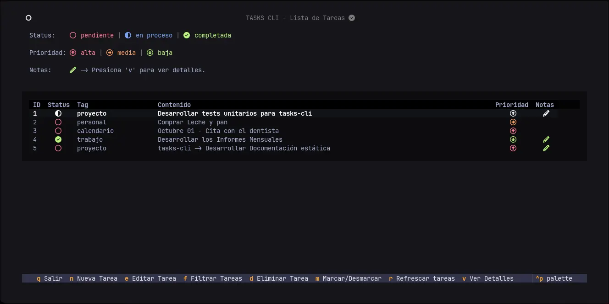

**Tasks-cli** es una aplicación de lista de tareas con interfaz en la terminal, diseñada para ser simple y eficiente.

    

Este proyecto, aunque sencillo en su funcionalidad, sirve como un mostrario de buenas prácticas de desarrollo en Python, incluyendo:

-   **Arquitectura Limpia:** Separación clara de responsabilidades en modelos, repositorios, servicios y controladores.
-   **Tipado Estricto:** Uso de `mypy` y `pydantic` para un código robusto y sin errores de tipo.
-   **Pruebas Rigurosas:** Implementación de tests unitarios con `pytest` para garantizar la fiabilidad.
-   **Interfaz de Usuario Moderna:** Construcción de una UI interactiva en la terminal con `Textual`.

Navega por las diferentes secciones para aprender a usar la aplicación, entender su arquitectura o contribuir a su desarrollo.
